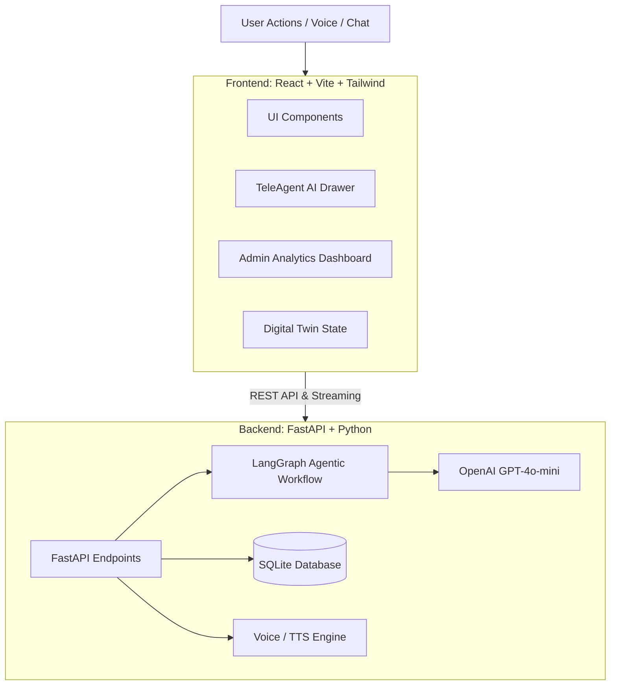
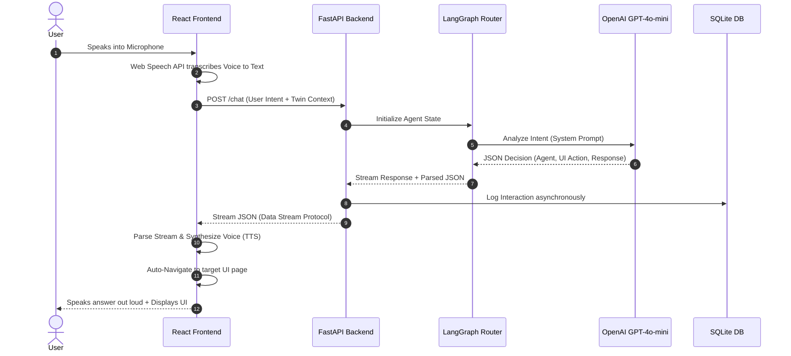

#  Omnichannel Consumer AI Engine for Digital Commerce

Welcome to the **Omnichannel Consumer AI Engine**, a state-of-the-art intelligent digital commerce platform designed to revolutionize customer experiences using AI-driven Digital Twins, real-time analytics, and seamless AI agent routing.

This project is built using a decoupled architecture, separating a highly interactive frontend from a robust, AI-powered backend.

---

##  Architecture Overview

The system is split into two primary components: the **Frontend** (Vite + React) and the **Backend** (FastAPI + LangGraph).



###  Request Flow (Sequence Architecture)

Here is exactly how a request travels through the system from the moment a user speaks to the moment the UI responds:



### 1.  The Frontend (`/fontend`)
Built with **Vite, React, and TailwindCSS**.
* **TeleAgent AI**: A persistent AI chat drawer accessible from anywhere in the app. Supports Voice Input and Text-to-Speech (TTS) output.
* **Customer Digital Twin**: Dynamically simulated user profiles (using randomuser.me) that hold browsing history, carts, loyalty points, and purchase intent.
* **Admin Dashboard**: Real-time analytics displaying user engagement, agent responses, and revenue metrics.
* **Deployment**: Configured for instant serverless deployment on **Vercel**.

### 2.  The Backend (`/backend_python`)
Built with **FastAPI, LangGraph, and Langchain**.
* **Multi-Agent Routing**: Uses `LangGraph` to route user intents intelligently to specific sub-agents (e.g., BillingAgent, SupportAgent, ProductAgent).
* **AI Streaming Protocol**: Streams AI responses word-by-word back to the frontend for a fast, responsive chat experience.
* **Data Layer**: Powered by asynchronous `aiosqlite`. Stores simulated product catalogs, promotions, and real-time agent interaction logs.
* **Deployment**: Configured for **Vercel Serverless Functions** with custom cold-start protections.

---

##  Getting Started Locally

### Prerequisites
* **Node.js** (v18+)
* **Python** (3.11+)
* **API Keys**: You will need an OpenAI API Key for the AI Agent.

### Setting up the Backend
1. Navigate to the backend directory:
   ```bash
   cd backend_python
   ```
2. Create a virtual environment and install dependencies:
   ```bash
   python -m venv venv
   source venv/bin/activate  # On Windows use: venv\Scripts\activate
   pip install -r requirements.txt
   ```
3. Create a `.env` file in the `backend_python` directory and add your keys:
   ```env
   OPENAI_API_KEY=your_openai_api_key_here
   ```
4. Start the FastAPI server:
   ```bash
   python main.py
   ```
   *The backend will run on `http://localhost:8000`*

### Setting up the Frontend
1. Navigate to the frontend directory:
   ```bash
   cd fontend
   ```
2. Install dependencies:
   ```bash
   npm install
   ```
3. Start the Vite development server:
   ```bash
   npm run dev
   ```
   *The frontend will run on `http://localhost:8080`*

---

## ☁️ Deployment

### Backend (Vercel)
The backend is configured for Vercel deployment via the `vercel.json` file.
1. Import the `backend_python` directory into Vercel.
2. Add your `OPENAI_API_KEY` to the Vercel Environment Variables.
3. Deploy!

### Frontend (Vercel)
The frontend is built with Vite, making it natively deployable on Vercel.
1. Import the `fontend` directory into Vercel.
2. Ensure the Framework Preset is set to **Vite**.
3. Deploy!

---

## ✨ Key Features
- **Dynamic User Simulation**: Switch between different simulated users and watch their Digital Twin state update in real time.
- **Voice-to-Voice AI**: Built-in Web Speech API integration allows for seamless voice interactions with the AI.
- **Agentic Workflows**: The AI isn't just a chatbot; it's a workflow router that navigates the user interface on behalf of the user based on their intent.
- **Real-time Metrics**: Admin dashboards automatically aggregate chat logs, purchases, and user behavior.
